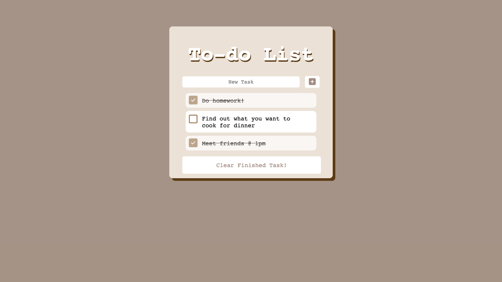
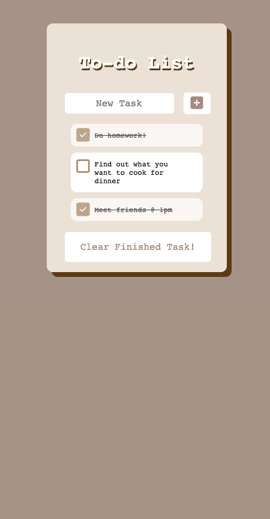

# ToDo-List 

## First introduction to Javascript.

### Desktop 

### Phone

- I learned how data is handled using functions and addEventListeners in this project. Also, utilizing localStorage to save data on the browser.

# Features

- [x] Task list
- [x] Add task
- [x] Delete task
- [x] Save on local storage
- [x] Responsive
- [x] Alert if input is not filled
